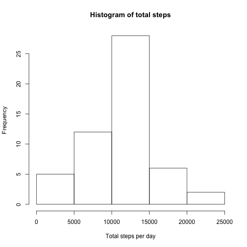
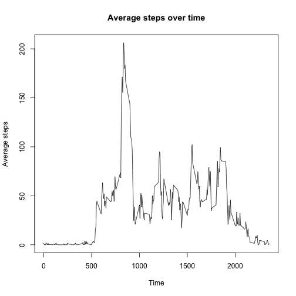
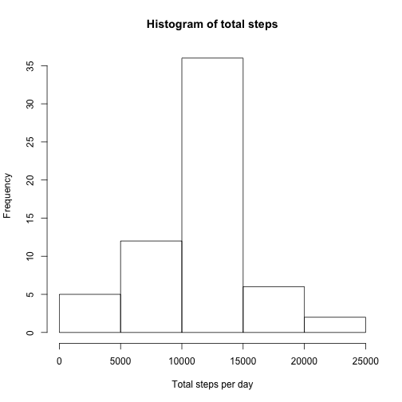
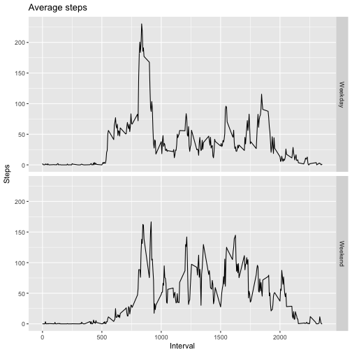

# Reproducible Research - Course Project 1


It is now possible to collect a large amount of data about personal movement using activity monitoring devices such as a Fitbit, Nike Fuelband, or Jawbone Up. These type of devices are part of the “quantified self” movement – a group of enthusiasts who take measurements about themselves regularly to improve their health, to find patterns in their behavior, or because they are tech geeks. But these data remain under-utilized both because the raw data are hard to obtain and there is a lack of statistical methods and software for processing and interpreting the data.

This assignment makes use of data from a personal activity monitoring device. This device collects data at 5 minute intervals through out the day. The data consists of two months of data from an anonymous individual collected during the months of October and November, 2012 and include the number of steps taken in 5 minute intervals each day.


### Loading and preprocessing the data

For loading the data to R, you need to have the zip-file 'repdata_data_activity.zip' or the respective unzipped 'activity.csv' in your working directory. If so, the data is loaded like this:

```r
# Set filenames
fileNameZip  <-"repdata_data_activity.zip"
fileNameUnzip<-"activity.csv"

# Unzip data if needed
if (!file.exists(fileNameUnzip)) { 
    unzip(fileNameZip)
    dateUnzipped <- date()
}

# Load the data
act<-read.csv(fileNameUnzip)
```

To get an overview of the data, we will look at the first rows as well as the structure and a summary:

```r
head(act)                    
```

```
##   steps       date interval
## 1    NA 2012-10-01        0
## 2    NA 2012-10-01        5
## 3    NA 2012-10-01       10
## 4    NA 2012-10-01       15
## 5    NA 2012-10-01       20
## 6    NA 2012-10-01       25
```

```r
str(act)                    
```

```
## 'data.frame':	17568 obs. of  3 variables:
##  $ steps   : int  NA NA NA NA NA NA NA NA NA NA ...
##  $ date    : Factor w/ 61 levels "2012-10-01","2012-10-02",..: 1 1 1 1 1 1 1 1 1 1 ...
##  $ interval: int  0 5 10 15 20 25 30 35 40 45 ...
```

```r
summary(act)
```

```
##      steps                date          interval     
##  Min.   :  0.00   2012-10-01:  288   Min.   :   0.0  
##  1st Qu.:  0.00   2012-10-02:  288   1st Qu.: 588.8  
##  Median :  0.00   2012-10-03:  288   Median :1177.5  
##  Mean   : 37.38   2012-10-04:  288   Mean   :1177.5  
##  3rd Qu.: 12.00   2012-10-05:  288   3rd Qu.:1766.2  
##  Max.   :806.00   2012-10-06:  288   Max.   :2355.0  
##  NA's   :2304     (Other)   :15840
```

Also, we will format the date variable of the data frame as date. This is needed for further processing:

```r
act$date<-as.Date(act$date)
```


### Total number of steps per day

To have a look at the total number of steps per day, we will aggregate the data and take the respective sums. Once this calculation is done, a histogram of this data is produced:

```r
sums <- aggregate(steps ~ date, data=act, sum)
hist(sums$steps,main="Histogram of total steps", xlab="Total steps per day")
```



We will also have a look at the mean and the median of the total steps per day:

```r
mean(sums$steps)
```

```
## [1] 10766.19
```

```r
median(sums$steps)
```

```
## [1] 10765
```


### Average daily activity

Next, we will have a look at the average daily activity. For this, we will aggregate the data and take the mean by respective time interval over all available days and plot this data:

```r
means <- aggregate(steps ~ interval, data=act, mean)
plot(means$interval, means$steps, type="l", 
     main="Average steps over time", 
     xlab="Time", ylab="Average steps")
```



The time interval with the maximum average activity can be obtained with the following R code:

```r
means[which.max(means$steps),]
```

```
##     interval    steps
## 104      835 206.1698
```


### Impute missing values

As we could see when looking at the first few rows of the activity data frame, there were some missing step values available. For this assignment, these missing values are imputed by the average value for the respective interval over all days. The imputed values are stored in the variable steps_imp:

```r
sum(is.na(act$steps))
```

```
## [1] 2304
```

```r
act$steps_imp<-act$steps
for(i in 1:length(act$steps)) { 
    if (is.na(act$steps[i])) { 
        act$steps_imp[i] <- means[means$interval==act$interval[i],]$steps
        }
}
```

Now we will run the analysis of the total number of steps per day again with the imputed values. The overall picture of the histogram will be mainly the same with smaller differences. The value of the median also differs a bit:

```r
sums_imp <- aggregate(steps_imp ~ date, data=act, sum)
hist(sums_imp$steps_imp,main="Histogram of total steps",
     xlab="Total steps per day")
```



```r
mean(sums_imp$steps_imp)
```

```
## [1] 10766.19
```

```r
median(sums_imp$steps_imp)
```

```
## [1] 10766.19
```


### Activity patterns on weekends vs. weekdays

To investigate possible differences of the activity patterns between weekends and weekdays, we first have to get a variable that shows this information.

```r
act$weekday<-weekdays(act$date)
act$weekend<-ifelse(act$weekday %in% c("Samstag", "Sonntag"), "Weekend", "Weekday")
```

Then, we will again take the average number of steps on weekends or weekdays in the respective intervals by aggregating the data:

```r
means_weekend <- aggregate(steps_imp ~ weekend+interval, data=act, mean)
```

A plot is produced to shows the differences. It is visible for example, that the activity starts a bit later on the weekends:

```r
library(ggplot2)
ggplot(data=means_weekend, aes(x=interval, y=steps_imp)) + 
    geom_line() +
    facet_grid(facets = weekend ~ .) +
    labs(title="Average steps", x="Interval", y="Steps")
```



